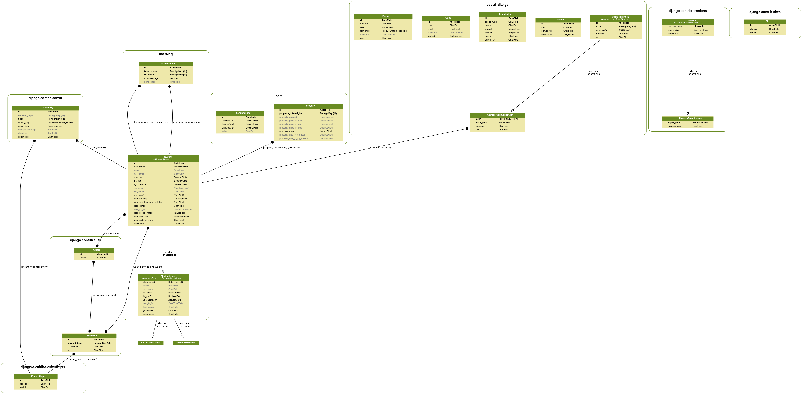

# Django 2+ based real-estate website

This has been developed for learning Django 2+ & Python 3+. 

**Goal:** To create something akin to <https://www.wg-gesucht.de> which would provide end-users (i.e. mostly students but also landlords) a way to advertise their free rooms.

The idea source was this article <https://www.respekt.cz/sousede/nekolik-nezavislych-lidi-bydli-v-jednom-pronajatem-byte>. 
The reason being is that, as of 2019, a real-estate portal dedicated to just the student housing does not exist - in the same form as it is in DACH region - in the Czech Republic. There are some similar sites but nothing compared to <https://www.wg-gesucht.de>. The objective is to fill the gap. 

## Azure Cloud Services Used

- Virtual Machines
- Key Vault
- DNS zone
- Blob Storage Account

## 1. How to deploy

### 1.1 Common tasks for <u>local and Heroku</u>

If **models have been changed**, following needs to be run on a **LOCAL PC**:

#### 1.1.1 Clean Postgres database 

If previously some deployments to the local PC have been executed, then one **has** to clean & prepare database again. 

```
sudo su postgres 
dropdb b40;
createdb b40;
logout
```

To create DB via `psql`, use 

```
CREATE DATABASE b40re;
CREATE USER jm WITH ENCRYPTED PASSWORD 'yourpass';
GRANT ALL PRIVILEGES ON DATABASE b40re TO jm;
```

#### 1.1.2 Collect static files

This also acts as a sort of test that can identify some errors early on. It also uploads static and media files directly to the Azure blob container.

```
python3 manage.py collectstatic
```

#### 1.1.3 Prepare migrations files

- Find and delete all `migrations` folders

```
find -type d -name migrations -prune -exec rm -rf {} \;
```

- Run makemigrations again

```
python3 manage.py makemigrations core && python3 manage.py makemigrations userMng
```

#### 1.1.4 Deploy to local PC

- Continue from previous steps

```
python3 manage.py migrate
```

#### 1.1.5 Deploy to Heroku

Heroku automatically runs collectstatic.

```
git push master heroku
```

### 1.2 Dont forget to create superuser

On local PC:
```
python3 manage.py createsuperuser --username admin --email ci@se.cz
```

On Heroku (via their cli):
```
heroku run python3 manage.py createsuperuser --username admin --email ci@se.cz
```

### 1.3 Deploy to own server

Execute on remote server following commands whenever models change.

**Oneliners**

```
python3 manage.py makemigrations core && python3 manage.py makemigrations userMng && python3 manage.py migrate && sudo systemctl restart gunicorn.service 
```

After pushing this to server, server contains a special post-recieve hook <https://gist.github.com/lemiorhan/8912188>

## 2. Common issues

- Kill heroku dyno

```
heroku ps && heroku ps:stop web.1
```

- Start Django manually

```
python3 manage.py runserver --nostatic
```

- Adding new SSL certificates via certbot (letsencrypt)

```
sudo certbot --nginx certonly
```

- Nginx 502 gateway issue after VM reboot

Just **restart** nginx, then `sudo systemctl restart gunicorn.service` as well as stop that socket thing

### The **ER** Diagramm

Created using <https://django-extensions.readthedocs.io/en/latest/graph_models.html> and 

```
python3 manage.py graph_models -a -g -o amazing_server_configuration/my_project_visualized.png
```




# 3. Run Celery and RabbitMQ Management UI

First install `RabbitMQ`, then `Celery`.

```
sudo rabbitmqctl add_user jm password
sudo rabbitmqctl set_user_tags jm administrator
```

Run `Celery` from b40re directory using

```
sudo systemctl restart rabbitmq<TAB>
celery -A vanoce worker -l info
```

Then, in an another `bash` window, execute commands below so that tasks such as fetching forex/currency data are run immediately.

```
python3 manage.py shell
from core.third_party_services.celery_tasks import parse_forex_data
rst = parse_forex_data.apply()
```

Source: <https://stackoverflow.com/a/12900126/2171456>

## 3.1 Setup Git Repo with post-recieve hook

The goal is to use AWS Cloud9 IDE to push -- on the same server (username@b40re.tk:/home/username/b40_push.git)-- to the git repository which acts as deployment repo. 

* E.g. for AWS Cloud9 IDE, first clone this repo 
* Create a new bare repo which is used for pushing and in it, add/register `post-recieve` hook. 
* See this guide <https://stackoverflow.com/a/40479963>

# 4. Notes

When you add new css/js to `static` folder, it is good idea to still run locally `python3 manage.py collectstatic` which will overwrite `staticfiles` & which again can be pushed to heroku (unless being ignored by `gitignore`). 

# 5. Sources

- <https://stackoverflow.com/a/40790734>

- <https://stackoverflow.com/a/50309967>


