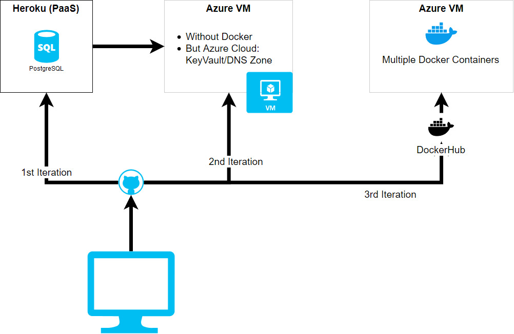
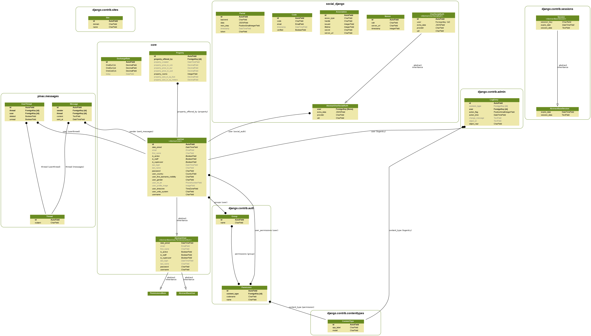

[](https://johnmalc.visualstudio.com/DJango-Wohn/_build/latest?definitionId=7&branchName=master)

# Basics: Python3/DJango2-based real-estate website

:heavy_exclamation_mark: This has been developed for learning Django 2+ & Python 3+ & Microsoft Azure & DevOps (Docker, Traefik, etc.). 

:triangular_flag_on_post: To create something akin to <https://www.wg-gesucht.de> which would provide students and landlords a way to advertise their free rooms.

The source of this "idea" was an article <https://www.respekt.cz/sousede/nekolik-nezavislych-lidi-bydli-v-jednom-pronajatem-byte>. 
In the Czech Republic, there are a lot of real-estate portals but very few exist which are dedicated to just student housing. 
Compared to <https://www.wg-gesucht.de>, in the similar form and scale there is nothing and thus the objective is to create a web application which fills the gap. 

## Development overtime 



## Azure Cloud Services

- Virtual Machines
- Azure KeyVault
- DNS zone -> 3rd Party Hosting Provider
- Azure Blob Storage

## 1. How to deploy

### 1.0 On (close to any) cloud provider

1. Create VM (scale set)

2. Install Docker

With `cloud-init`, you can do
```
#include https://get.docker.com
```

2.1 Create a separate docker volume for **each** container, e.g. `docker volume create --driver local --opt type=none --opt device=/datadrive/django --opt o=bind datadrive_django
`

3. Clone this repo and cd' into it

4. Start `docker-compose -f docker-compose.yaml up (-d)`

### 1.1 Common tasks for <u>local and Heroku</u>

If **models have been changed**, following needs to be run on a **LOCAL PC**:

#### 1.1.1 Clean Postgres database 

If previously some deployments to the local PC have been executed, then one **has** to clean & prepare database again. 

```
sudo su postgres 
psql
```

To create DB via `psql`, use 

```
CREATE DATABASE b40re;
CREATE USER jm WITH ENCRYPTED PASSWORD 'yourpass';
GRANT ALL PRIVILEGES ON DATABASE b40re TO jm;
```

To install pgadmin4, follow <https://www.pgadmin.org/docs/pgadmin4/4.x/server_deployment.html>

#### 1.1.2 Collect static files

This also acts as a sort of test that can identify some errors early on. It also uploads static and media files directly to the Azure blob container.

```
python3 manage.py collectstatic
```

#### 1.1.3 Prepare migrations files

- Find and delete all `migrations` folders

```
find -type d -name migrations -prune -exec rm -rf {} \;
```

- Run makemigrations again

```
python3 manage.py makemigrations core && python3 manage.py makemigrations userMng
```

Deploy to local/on remote server

```
python3 manage.py migrate
```

#### 1.1.5 Deploy to Heroku

Heroku automatically runs collectstatic.

```
git push master heroku
```

### 1.2 Dont forget to create superuser

On local PC:
```
python3 manage.py createsuperuser --username admin --email ci@se.cz
```

On Heroku (via their cli):
```
heroku run python3 manage.py createsuperuser --username admin --email ci@se.cz
```

### 1.3 Deploy to own server

Execute on remote server following commands whenever models change.

**Oneliners**

```
python3 manage.py makemigrations core && python3 manage.py makemigrations userMng && python3 manage.py migrate && sudo systemctl restart gunicorn.service 
```

After pushing this to server, server contains a special post-recieve hook <https://gist.github.com/lemiorhan/8912188>

## 2. Common issues

- Kill heroku dyno

```
heroku ps && heroku ps:stop web.1
```

- Start Django manually

```
python3 manage.py runserver --nostatic
```

- Adding new SSL certificates via certbot (letsencrypt)

```
sudo certbot --nginx certonly
```

- Nginx 502 gateway issue after VM reboot

Just **restart** nginx, then `sudo systemctl restart gunicorn.service` as well as stop that socket thing

### The **ER**/Class Diagramms

Created using <https://django-extensions.readthedocs.io/en/latest/graph_models.html> and 

```
python3 manage.py graph_models -a -g -o arch/class_diagramm.png
```




# 3. Run Celery and RabbitMQ Management UI

First install `RabbitMQ`, then `Celery`.

```
sudo rabbitmq-plugins enable rabbitmq_management
sudo rabbitmqctl add_user jm password
sudo rabbitmqctl set_user_tags jm administrator
```

Run `Celery` from b40re directory using

```
sudo systemctl restart rabbitmq<TAB>
celery -A vanoce worker -l info
```

Then, in an another `bash` window, execute commands below so that tasks such as fetching forex/currency data are run immediately.

```
python3 manage.py shell
from userMng.third_party_services.celery_tasks import parse_forex_data
rst = parse_forex_data.apply()
```

Source: <https://stackoverflow.com/a/12900126/2171456>

## 3.1 Setup Git Repo with post-recieve hook

The goal is to use AWS Cloud9 IDE to push -- on the same server (username@b40re.tk:/home/username/b40_push.git)-- to the git repository which acts as deployment repo. 

* E.g. for AWS Cloud9 IDE, first clone this repo 
* Create a new bare repo which is used for pushing and in it, add/register `post-recieve` hook. 
* See this guide <https://stackoverflow.com/a/40479963>

# 4. Notes

When you add new css/js to `static` folder, it is good idea to still run locally `python3 manage.py collectstatic` which will overwrite `staticfiles` & which again can be pushed to heroku (unless being ignored by `gitignore`). 

# 5. Sources

- <https://stackoverflow.com/a/40790734>

- <https://stackoverflow.com/a/50309967>


