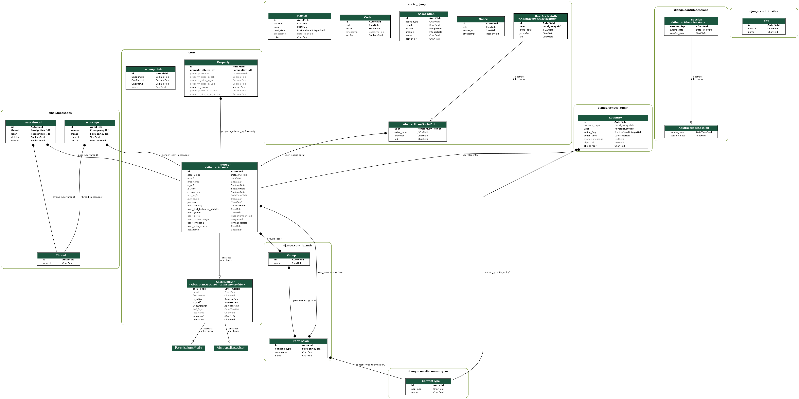

## Development overtime 

This graphic shows how CI/CD + architecture looked like in the past.


## App's Class Diagramm 

Created using <https://django-extensions.readthedocs.io/en/latest/graph_models.html> and 

```
python3 manage.py graph_models -a -g -o arch/class_diagramm.png
```

