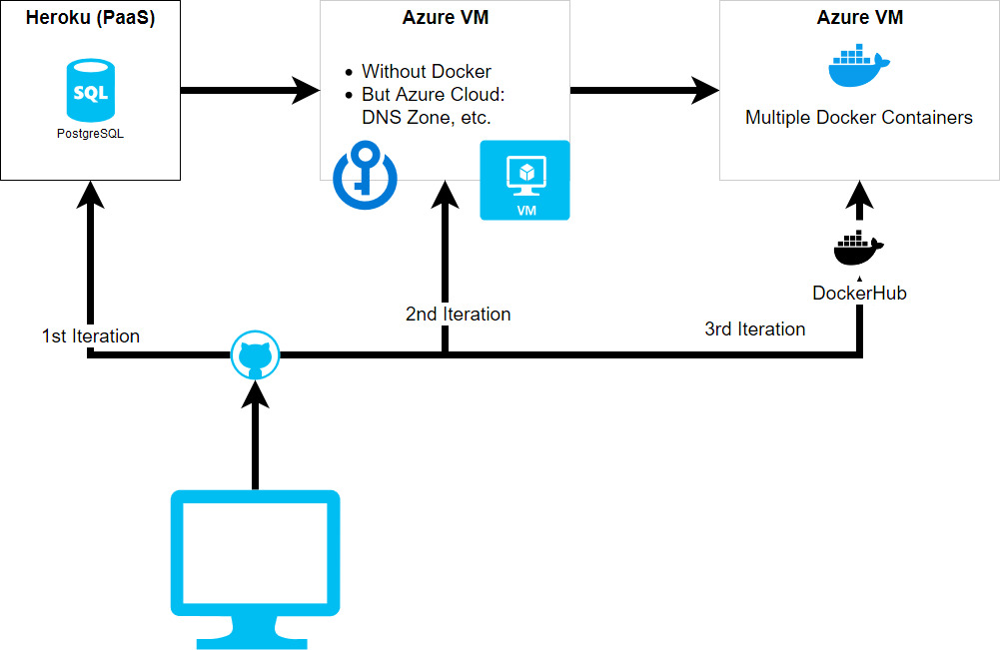
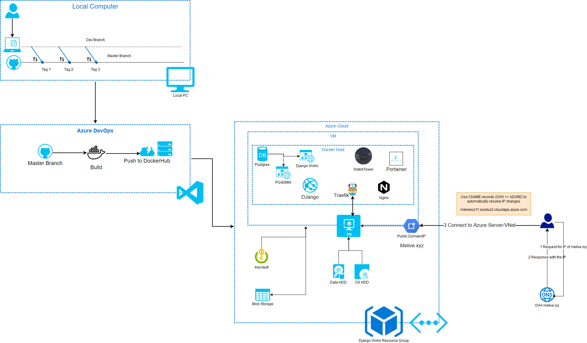
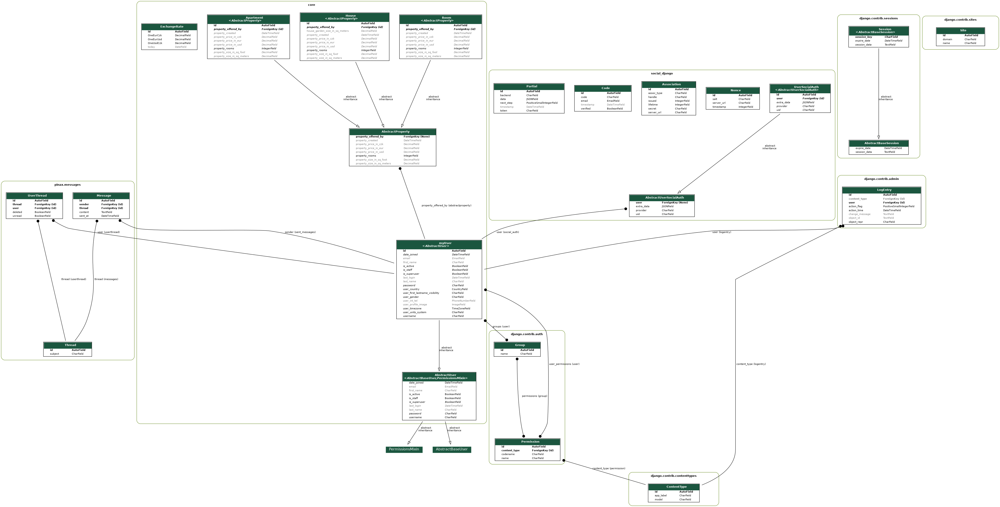
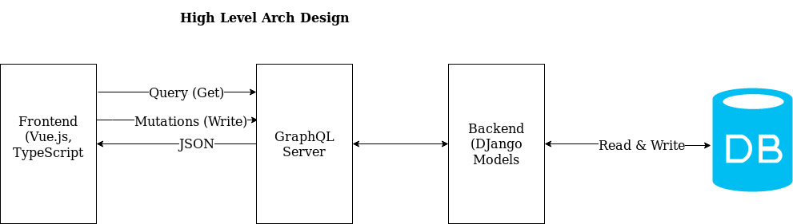

# Development over the time

Shows how CI/CD + architecture looked like in the past.



# CI/CD Pipeline

Shows current deployment pipeline, from local changes to building a container on server.



# App's Class Diagramm

Created using <https://django-extensions.readthedocs.io/en/latest/graph_models.html>.

During container runtime, command below is executed "manually":

```shell
python3 manage.py graph_models -a -g -o output/class_diagram.png
```

In order to extract diagram which has been created in the `output` folder, use:

```shell
docker cp $(docker images --filter=reference="djwohn:latest" -q):/wohn/output ~/
```

Look for `~/output` folder





# App's High Level Architecture


