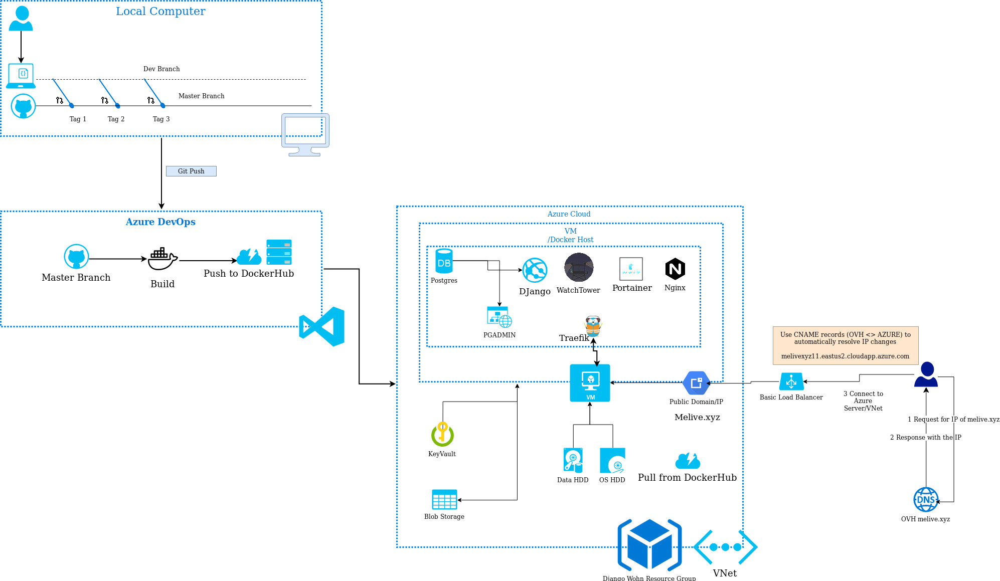

# Development over the time

Shows how CI/CD + architecture looked like in the past.


# CI/CD Pipeline

Shows current deployment pipeline, from local changes to building a container on server.



# App's Class Diagramm

Created using <https://django-extensions.readthedocs.io/en/latest/graph_models.html>.

During container runtime, executed manually:

```shell
python3 manage.py graph_models -a -g -o arch/class_diagramm.png
```


# App's High Level Architecture


